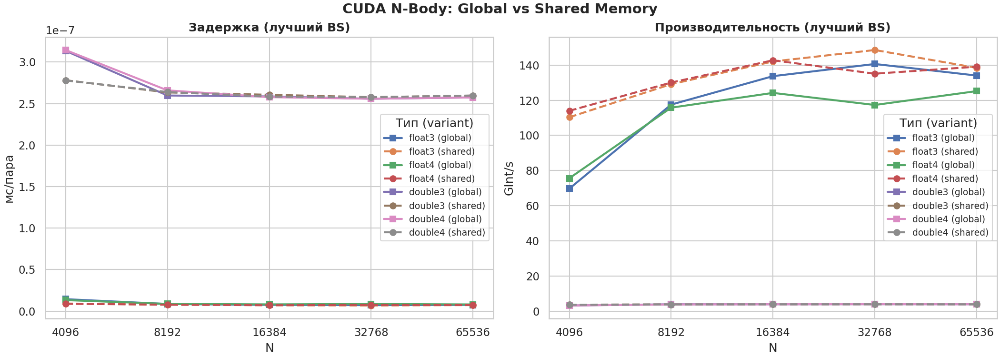
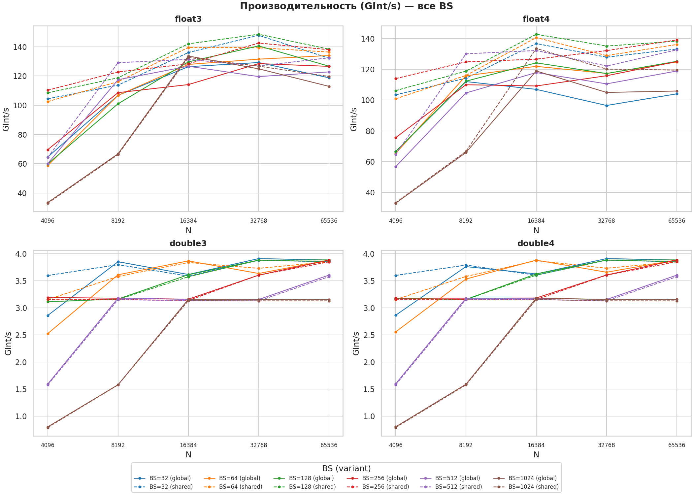
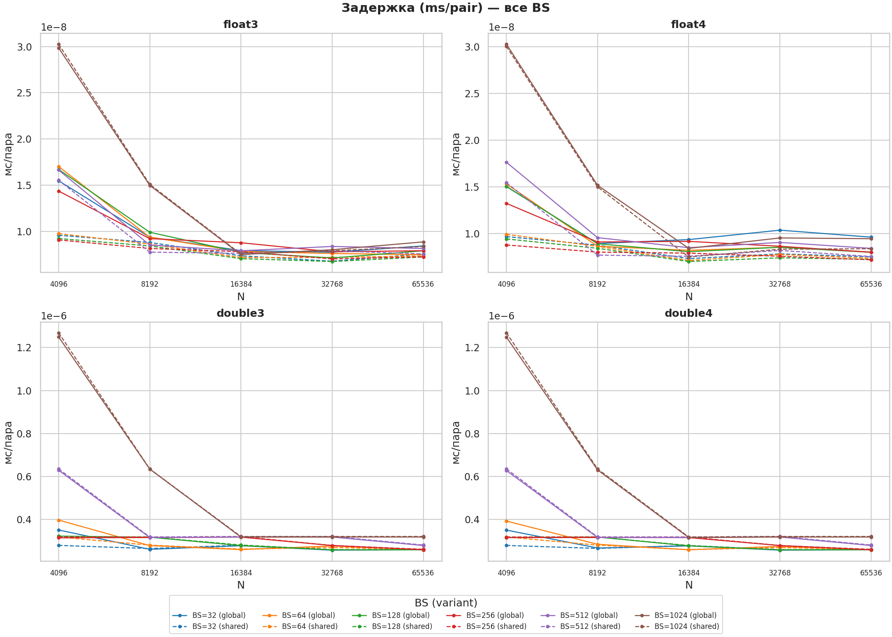

# CUDA N-Body Simulation Performance Analysis

Репозиторий содержит результаты исследования производительности и оптимизации алгоритма симуляции N-тел (N-Body) с использованием технологии NVIDIA CUDA на графическом процессоре архитектуры Turing (**NVIDIA GeForce GTX 1650 SUPER**).

## Ключевые результаты и анализ

### 1. Оптимизация памяти: Global vs Shared Memory
Использование разделяемой памяти (**Shared Memory**) с применением техники тайлинга позволяет обойти ограничение пропускной способности глобальной видеопамяти (VRAM).
* **Прирост производительности:** 15–20% по сравнению с глобальной памятью.
* **Пиковая вычислительная скорость:** **146.8 GInt/s** (миллиардов взаимодействий в секунду).

### 2. Влияние размера блока (Block Size)
Размер блока (Block Size, BS) оказывает определяющее влияние на степень утилизации мультипроцессоров (Occupancy).
* **Оптимальные параметры:** `BS = 128` и `BS = 256` представляют собой "золотую середину" для архитектуры Turing, обеспечивая максимальное скрытие задержек.
* **Аномалия при BS = 1024:** Наблюдается резкое **четырехкратное падение производительности** (до ~35 GInt/s). 
  * *Причина:* Возникает сильное "регистровое давление" (Register Pressure). Каждому потоку требуется фиксированное число регистров, и при 1024 потоках на блок исчерпываются ресурсы регистрового файла Streaming Multiprocessor (SM). Это приводит к критическому снижению Occupancy — планировщик варпов (Warp Scheduler) теряет возможность параллельного выполнения и переключения между варпами для скрытия задержек памяти.

### 3. Производительность типов данных (Float vs Double)
Тестирование наглядно демонстрирует выраженную аппаратную специализацию игровой архитектуры GPU.
* **Одинарная точность (FP32 - float3/float4):** Высокая эффективность вычислений, пик до **~147 GInt/s**. Оптимальным выбором является векторный тип `float3` в сочетании со Shared Memory благодаря более эффективной работе с банками памяти.
* **Двойная точность (FP64 - double3/double4):** Производительность катастрофически падает до **3.9 GInt/s**. Вычисления в режиме `double` выполняются в **37 раз медленнее**, чем во `float`, поскольку чип GTX 1650 SUPER имеет крайне ограниченное число аппаратных блоков FP64.

### 4. Анализ задержек (Latency)
Задержка, приходящаяся на расчет одной пары взаимодействующих тел (мс/пара), снижается до своего минимума при больших объемах выборки (N ≥ 16384). В этом режиме графический процессор полностью насыщается вычислительной нагрузкой, эффективно маскируя задержки инструкций чтения-записи.

---

## Резюме и оптимальная конфигурация

Для обеспечения максимального быстродействия CUDA-ядер при решении задач N-Body на архитектуре Turing рекомендуется использовать следующую конфигурацию:
* **Архитектурный паттерн:** Тайлинг с использованием **Shared Memory**.
* **Тип данных:** Векторный тип **`float3`** (одинарная точность).
* **Размер блока:** **`Block Size = 128`** (обеспечивает наилучший баланс распределения регистров и утилизации ядер).